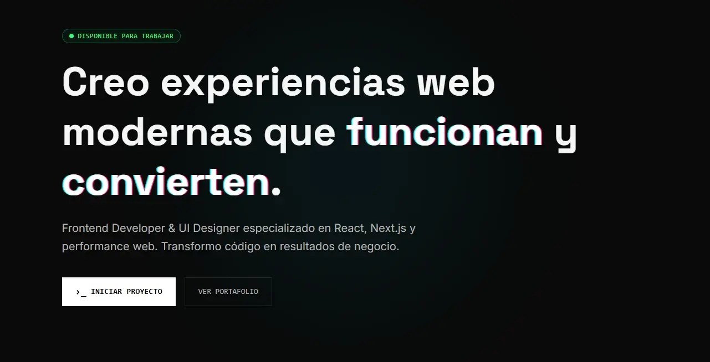

# Gersom Bahena | Frontend Developer Portfolio V2



> An immersive, high-performance portfolio built with **Next.js 14 (App Router)** and **Tailwind CSS**. Designed with a focus on Accessibility (A11y), SEO, and a distinctive "Glitch/Cyberpunk" aesthetic.

## 🚀 Key Features

- **⚡ Zero Layout Shift:** Optimized images and component architecture to prevent CLS.
- **🌐 Internationalization (i18n):** Full support for English and Spanish via React Context without external bloat.
- **♿ Accessibility First:**
  - Semantic HTML5 structure.
  - `aria-labels` and roles for screen readers.
  - `focus-visible` states for keyboard navigation.
  - Reduced motion support for sensitive users.
- **🎨 Glitch UI System:** Custom Tailwind configuration for neon effects, scanlines, and CRT animations.
- **🔒 Secure Contact Form:** Implementation of Honeypot fields and Time-based validation to prevent spam without CAPTCHA.
- **📱 Mobile First:** Responsive design ensuring a native-app feel on mobile devices.

## 🛠️ Tech Stack

- **Framework:** [Next.js 14](https://nextjs.org/) (App Router)
- **Styling:** [Tailwind CSS](https://tailwindcss.com/)
- **Animations:** [Framer Motion](https://www.framer.com/motion/)
- **Language:** [TypeScript](https://www.typescriptlang.org/)
- **Form Handling:** Server Actions / API Routes + Nodemailer
- **Deployment:** [Vercel](https://vercel.com/)

## 🏃‍♂️ Getting Started

1. **Clone the repository:**
   ```bash
   git clone [https://github.com/Gersombs/portfolio-v2.git](https://github.com/Gersombs/portfolio-v2.git)
   cd portfolio-v2
Install dependencies:

Bash
npm install
Set up Environment Variables: Create a .env.local file in the root directory:

Fragmento de código
EMAIL_USER=your-email@gmail.com
EMAIL_PASS=your-app-password
Run the development server:

Bash
npm run dev
Open http://localhost:3000 with your browser to see the result.

📂 Project Structure
Bash
src/
├── app/              # App Router pages and layout
├── components/       
│   ├── sections/     # Landing page sections (Hero, Projects, Contact)
│   ├── ui/           # Reusable UI components (Buttons, Cards)
│   └── sub/          # Utility components
├── context/          # Global state (LanguageContext)
├── hooks/            # Custom hooks (useActiveSection)
└── lib/              # Utilities and helpers
🔍 SEO & Performance Strategy
This project follows Core Web Vitals best practices:

LCP (Largest Contentful Paint): Critical images are preloaded with priority.

CLS (Cumulative Layout Shift): Fixed aspect ratios and overlay techniques for project cards.

SEO: Dynamic metadata, OpenGraph tags, and semantic landmarks.

📬 Contact
Gersom Bahena Frontend Developer & UI Engineer

LinkedIn

© 2026 Gersom Bahena. Built with code and caffeine.